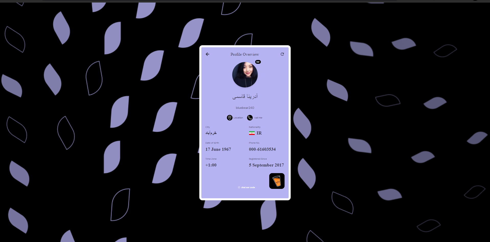
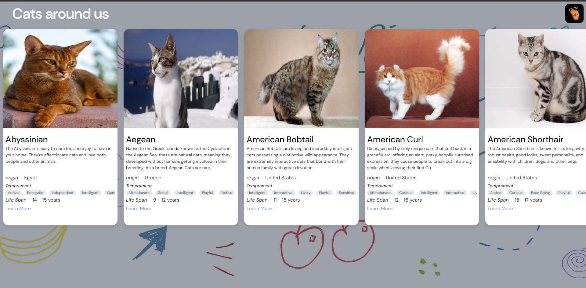

# Assignment: React Components with FreeAPI.app Integration

This assignment showcases the development of three distinct tasks using React, based on the provided Figma designs. The tasks involve API integration with FreeAPI.app, focusing on implementing Random User Profile, Random Jokes Tweet, and Cats Listing components.

## Live URL 
- [https://master-ji-test-1.vercel.app/]

## Table of Contents
- [Task 1: Random User Profile](#task-1-random-user-profile)
- [Task 2: Random Jokes Tweet](#task-2-random-jokes-tweet)
- [Task 3: Cats Listing](#task-3-cats-listing)
- [Styling](#stying)
- [Project Structure](#project-structure)
- [Installation](#installation)
- [Usage](#usage)
- [Screenshots](#screenshots)
- [API References](#api-references)

## Task 1: Random User Profile

### Description
- **Component Styling**: The Random User Profile component matches the design provided in Figma.
- **Refresh Button**: A refresh button is implemented to fetch a new set of random user data.
- **Loading State**: A creative loading state is displayed while fetching data.
- **API Data Mapping**: API response fields are mapped precisely as per the Figma design.
- **Hyperlinks**: Location and call actions are hyperlinked to open in a new tab.

### API Endpoint
- [Random User API](https://api.freeapi.app/api/v1/public/randomusers/user/random)

### Screenshots


## Task 2: Random Jokes Tweet

### Description
- **Static Author Details**: The tweet author details are kept static (e.g., Elon Musk).
- **Random Analytics**: Timestamp, views, date, and other analytics are randomly generated.
- **Loading State**: A creative loading state is implemented during data fetch.
- **Auto-Refresh**: On page reload, the tweet card content is updated with new joke data.

### API Endpoint
- [Random Jokes API](https://api.freeapi.app/api/v1/public/randomjokes/joke/random)

### Screenshots


## Task 3: Cats Listing

### Description
- **Horizontal Scrolling Cards**: A paginated list of horizontally scrolling cards is implemented to display cats information.
- **Loading State**: A creative loading state is shown while fetching data.
- **Pagination**: Pagination is handled effectively to list all cats from the database.

### API Endpoint
- [Cats Listing API](https://api.freeapi.app/api/v1/public/cats?page=1&limit=4)

### Screenshots


## Styling
- For the styling Tailwind Css is used
- For the fonts Google Fonts are used
## Project Structure
- `/random-user`: Displays the Random User Profile component.
- `/random-jokes`: Displays the Random Jokes Tweet component.
- `/cats-listing`: Displays the Cats Listing component.
- `/`: Redirects to `/random-user`.

## Installation
1. Clone the repository:
   ```bash
   git clone https://github.com/yourusername/yourrepository.git

